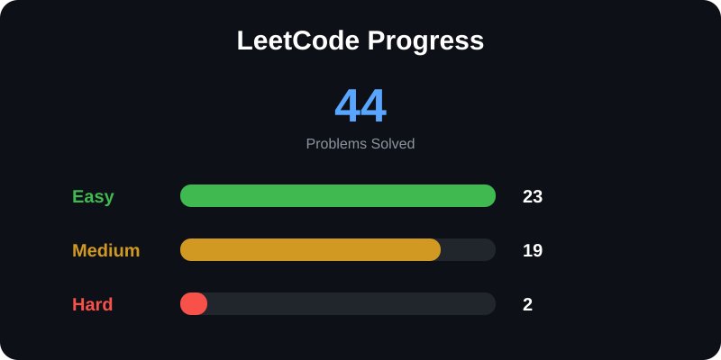

Welcome to my LeetCode Solutions repository!

This repository contains my solutions to various LeetCode problems that I solve while improving my skills in **Data Structures and Algorithms (DSA)** and problem-solving.

## 📊 LeetCode Progress

  

<!---LeetCode Topics Start-->
# LeetCode Topics
## Hash Table
|  |
| ------- |
| [0229-majority-element-ii](https://github.com/berwincr/leetcode_solutions/tree/master/0229-majority-element-ii) |
| [0424-longest-repeating-character-replacement](https://github.com/berwincr/leetcode_solutions/tree/master/0424-longest-repeating-character-replacement) |
| [0448-find-all-numbers-disappeared-in-an-array](https://github.com/berwincr/leetcode_solutions/tree/master/0448-find-all-numbers-disappeared-in-an-array) |
| [0645-set-mismatch](https://github.com/berwincr/leetcode_solutions/tree/master/0645-set-mismatch) |
| [0992-subarrays-with-k-different-integers](https://github.com/berwincr/leetcode_solutions/tree/master/0992-subarrays-with-k-different-integers) |
| [1365-how-many-numbers-are-smaller-than-the-current-number](https://github.com/berwincr/leetcode_solutions/tree/master/1365-how-many-numbers-are-smaller-than-the-current-number) |
## String
|  |
| ------- |
| [0008-string-to-integer-atoi](https://github.com/berwincr/leetcode_solutions/tree/master/0008-string-to-integer-atoi) |
| [0028-find-the-index-of-the-first-occurrence-in-a-string](https://github.com/berwincr/leetcode_solutions/tree/master/0028-find-the-index-of-the-first-occurrence-in-a-string) |
| [0424-longest-repeating-character-replacement](https://github.com/berwincr/leetcode_solutions/tree/master/0424-longest-repeating-character-replacement) |
## Sliding Window
|  |
| ------- |
| [0424-longest-repeating-character-replacement](https://github.com/berwincr/leetcode_solutions/tree/master/0424-longest-repeating-character-replacement) |
| [0992-subarrays-with-k-different-integers](https://github.com/berwincr/leetcode_solutions/tree/master/0992-subarrays-with-k-different-integers) |
## Array
|  |
| ------- |
| [0018-4sum](https://github.com/berwincr/leetcode_solutions/tree/master/0018-4sum) |
| [0229-majority-element-ii](https://github.com/berwincr/leetcode_solutions/tree/master/0229-majority-element-ii) |
| [0448-find-all-numbers-disappeared-in-an-array](https://github.com/berwincr/leetcode_solutions/tree/master/0448-find-all-numbers-disappeared-in-an-array) |
| [0645-set-mismatch](https://github.com/berwincr/leetcode_solutions/tree/master/0645-set-mismatch) |
| [0992-subarrays-with-k-different-integers](https://github.com/berwincr/leetcode_solutions/tree/master/0992-subarrays-with-k-different-integers) |
| [1365-how-many-numbers-are-smaller-than-the-current-number](https://github.com/berwincr/leetcode_solutions/tree/master/1365-how-many-numbers-are-smaller-than-the-current-number) |
| [3875-construct-uniform-parity-array-i](https://github.com/berwincr/leetcode_solutions/tree/master/3875-construct-uniform-parity-array-i) |
| [3903-smallest-stable-index-i](https://github.com/berwincr/leetcode_solutions/tree/master/3903-smallest-stable-index-i) |
| [3904-smallest-stable-index-ii](https://github.com/berwincr/leetcode_solutions/tree/master/3904-smallest-stable-index-ii) |
## Counting
|  |
| ------- |
| [0229-majority-element-ii](https://github.com/berwincr/leetcode_solutions/tree/master/0229-majority-element-ii) |
| [0992-subarrays-with-k-different-integers](https://github.com/berwincr/leetcode_solutions/tree/master/0992-subarrays-with-k-different-integers) |
## Bit Manipulation
|  |
| ------- |
| [0645-set-mismatch](https://github.com/berwincr/leetcode_solutions/tree/master/0645-set-mismatch) |
## Sorting
|  |
| ------- |
| [0018-4sum](https://github.com/berwincr/leetcode_solutions/tree/master/0018-4sum) |
| [0229-majority-element-ii](https://github.com/berwincr/leetcode_solutions/tree/master/0229-majority-element-ii) |
| [0645-set-mismatch](https://github.com/berwincr/leetcode_solutions/tree/master/0645-set-mismatch) |
| [1365-how-many-numbers-are-smaller-than-the-current-number](https://github.com/berwincr/leetcode_solutions/tree/master/1365-how-many-numbers-are-smaller-than-the-current-number) |
## Two Pointers
|  |
| ------- |
| [0018-4sum](https://github.com/berwincr/leetcode_solutions/tree/master/0018-4sum) |
| [0028-find-the-index-of-the-first-occurrence-in-a-string](https://github.com/berwincr/leetcode_solutions/tree/master/0028-find-the-index-of-the-first-occurrence-in-a-string) |
## String Matching
|  |
| ------- |
| [0028-find-the-index-of-the-first-occurrence-in-a-string](https://github.com/berwincr/leetcode_solutions/tree/master/0028-find-the-index-of-the-first-occurrence-in-a-string) |
## Z Algorithm
|  |
| ------- |
| [0028-find-the-index-of-the-first-occurrence-in-a-string](https://github.com/berwincr/leetcode_solutions/tree/master/0028-find-the-index-of-the-first-occurrence-in-a-string) |
## Knuth–Morris–Pratt Algorithm
|  |
| ------- |
| [0028-find-the-index-of-the-first-occurrence-in-a-string](https://github.com/berwincr/leetcode_solutions/tree/master/0028-find-the-index-of-the-first-occurrence-in-a-string) |
## Boyer–Moore String-Search Algorithm
|  |
| ------- |
| [0028-find-the-index-of-the-first-occurrence-in-a-string](https://github.com/berwincr/leetcode_solutions/tree/master/0028-find-the-index-of-the-first-occurrence-in-a-string) |
## Math
|  |
| ------- |
| [3875-construct-uniform-parity-array-i](https://github.com/berwincr/leetcode_solutions/tree/master/3875-construct-uniform-parity-array-i) |
## Counting Sort
|  |
| ------- |
| [1365-how-many-numbers-are-smaller-than-the-current-number](https://github.com/berwincr/leetcode_solutions/tree/master/1365-how-many-numbers-are-smaller-than-the-current-number) |
## Prefix Sum
|  |
| ------- |
| [3903-smallest-stable-index-i](https://github.com/berwincr/leetcode_solutions/tree/master/3903-smallest-stable-index-i) |
| [3904-smallest-stable-index-ii](https://github.com/berwincr/leetcode_solutions/tree/master/3904-smallest-stable-index-ii) |
## Boyer–Moore Majority Vote Algorithm
|  |
| ------- |
| [0229-majority-element-ii](https://github.com/berwincr/leetcode_solutions/tree/master/0229-majority-element-ii) |
<!---LeetCode Topics End-->
