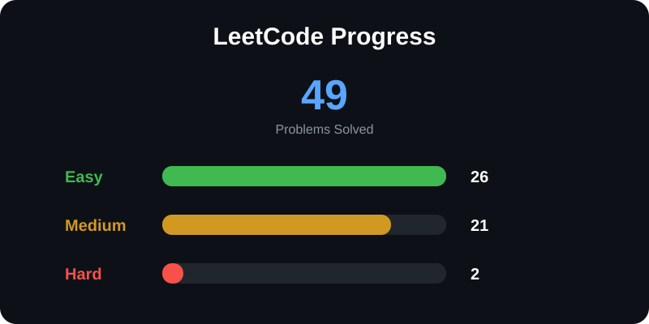

Welcome to my LeetCode Solutions repository!

This repository contains my solutions to various LeetCode problems that I solve while improving my skills in **Data Structures and Algorithms (DSA)** and problem-solving.

## 📊 LeetCode Progress

  

<!---LeetCode Topics Start-->
# LeetCode Topics
## Hash Table
|  |
| ------- |
| [0169-majority-element](https://github.com/berwincr/leetcode_solutions/tree/master/0169-majority-element) |
| [0229-majority-element-ii](https://github.com/berwincr/leetcode_solutions/tree/master/0229-majority-element-ii) |
| [0268-missing-number](https://github.com/berwincr/leetcode_solutions/tree/master/0268-missing-number) |
| [0389-find-the-difference](https://github.com/berwincr/leetcode_solutions/tree/master/0389-find-the-difference) |
| [0424-longest-repeating-character-replacement](https://github.com/berwincr/leetcode_solutions/tree/master/0424-longest-repeating-character-replacement) |
| [0448-find-all-numbers-disappeared-in-an-array](https://github.com/berwincr/leetcode_solutions/tree/master/0448-find-all-numbers-disappeared-in-an-array) |
| [0621-task-scheduler](https://github.com/berwincr/leetcode_solutions/tree/master/0621-task-scheduler) |
| [0645-set-mismatch](https://github.com/berwincr/leetcode_solutions/tree/master/0645-set-mismatch) |
| [0846-hand-of-straights](https://github.com/berwincr/leetcode_solutions/tree/master/0846-hand-of-straights) |
| [0930-binary-subarrays-with-sum](https://github.com/berwincr/leetcode_solutions/tree/master/0930-binary-subarrays-with-sum) |
| [0992-subarrays-with-k-different-integers](https://github.com/berwincr/leetcode_solutions/tree/master/0992-subarrays-with-k-different-integers) |
| [1207-unique-number-of-occurrences](https://github.com/berwincr/leetcode_solutions/tree/master/1207-unique-number-of-occurrences) |
| [1248-count-number-of-nice-subarrays](https://github.com/berwincr/leetcode_solutions/tree/master/1248-count-number-of-nice-subarrays) |
| [1358-number-of-substrings-containing-all-three-characters](https://github.com/berwincr/leetcode_solutions/tree/master/1358-number-of-substrings-containing-all-three-characters) |
| [1365-how-many-numbers-are-smaller-than-the-current-number](https://github.com/berwincr/leetcode_solutions/tree/master/1365-how-many-numbers-are-smaller-than-the-current-number) |
| [1657-determine-if-two-strings-are-close](https://github.com/berwincr/leetcode_solutions/tree/master/1657-determine-if-two-strings-are-close) |
| [1679-max-number-of-k-sum-pairs](https://github.com/berwincr/leetcode_solutions/tree/master/1679-max-number-of-k-sum-pairs) |
| [2215-find-the-difference-of-two-arrays](https://github.com/berwincr/leetcode_solutions/tree/master/2215-find-the-difference-of-two-arrays) |
| [2965-find-missing-and-repeated-values](https://github.com/berwincr/leetcode_solutions/tree/master/2965-find-missing-and-repeated-values) |
| [3483-unique-3-digit-even-numbers](https://github.com/berwincr/leetcode_solutions/tree/master/3483-unique-3-digit-even-numbers) |
## String
|  |
| ------- |
| [0008-string-to-integer-atoi](https://github.com/berwincr/leetcode_solutions/tree/master/0008-string-to-integer-atoi) |
| [0020-valid-parentheses](https://github.com/berwincr/leetcode_solutions/tree/master/0020-valid-parentheses) |
| [0028-find-the-index-of-the-first-occurrence-in-a-string](https://github.com/berwincr/leetcode_solutions/tree/master/0028-find-the-index-of-the-first-occurrence-in-a-string) |
| [0345-reverse-vowels-of-a-string](https://github.com/berwincr/leetcode_solutions/tree/master/0345-reverse-vowels-of-a-string) |
| [0389-find-the-difference](https://github.com/berwincr/leetcode_solutions/tree/master/0389-find-the-difference) |
| [0392-is-subsequence](https://github.com/berwincr/leetcode_solutions/tree/master/0392-is-subsequence) |
| [0394-decode-string](https://github.com/berwincr/leetcode_solutions/tree/master/0394-decode-string) |
| [0424-longest-repeating-character-replacement](https://github.com/berwincr/leetcode_solutions/tree/master/0424-longest-repeating-character-replacement) |
| [0443-string-compression](https://github.com/berwincr/leetcode_solutions/tree/master/0443-string-compression) |
| [0856-score-of-parentheses](https://github.com/berwincr/leetcode_solutions/tree/master/0856-score-of-parentheses) |
| [0921-minimum-add-to-make-parentheses-valid](https://github.com/berwincr/leetcode_solutions/tree/master/0921-minimum-add-to-make-parentheses-valid) |
| [1358-number-of-substrings-containing-all-three-characters](https://github.com/berwincr/leetcode_solutions/tree/master/1358-number-of-substrings-containing-all-three-characters) |
| [1456-maximum-number-of-vowels-in-a-substring-of-given-length](https://github.com/berwincr/leetcode_solutions/tree/master/1456-maximum-number-of-vowels-in-a-substring-of-given-length) |
| [1614-maximum-nesting-depth-of-the-parentheses](https://github.com/berwincr/leetcode_solutions/tree/master/1614-maximum-nesting-depth-of-the-parentheses) |
| [1657-determine-if-two-strings-are-close](https://github.com/berwincr/leetcode_solutions/tree/master/1657-determine-if-two-strings-are-close) |
| [2390-removing-stars-from-a-string](https://github.com/berwincr/leetcode_solutions/tree/master/2390-removing-stars-from-a-string) |
## Sliding Window
|  |
| ------- |
| [0424-longest-repeating-character-replacement](https://github.com/berwincr/leetcode_solutions/tree/master/0424-longest-repeating-character-replacement) |
| [0930-binary-subarrays-with-sum](https://github.com/berwincr/leetcode_solutions/tree/master/0930-binary-subarrays-with-sum) |
| [0992-subarrays-with-k-different-integers](https://github.com/berwincr/leetcode_solutions/tree/master/0992-subarrays-with-k-different-integers) |
| [1248-count-number-of-nice-subarrays](https://github.com/berwincr/leetcode_solutions/tree/master/1248-count-number-of-nice-subarrays) |
| [1358-number-of-substrings-containing-all-three-characters](https://github.com/berwincr/leetcode_solutions/tree/master/1358-number-of-substrings-containing-all-three-characters) |
| [1456-maximum-number-of-vowels-in-a-substring-of-given-length](https://github.com/berwincr/leetcode_solutions/tree/master/1456-maximum-number-of-vowels-in-a-substring-of-given-length) |
## Array
|  |
| ------- |
| [0011-container-with-most-water](https://github.com/berwincr/leetcode_solutions/tree/master/0011-container-with-most-water) |
| [0018-4sum](https://github.com/berwincr/leetcode_solutions/tree/master/0018-4sum) |
| [0026-remove-duplicates-from-sorted-array](https://github.com/berwincr/leetcode_solutions/tree/master/0026-remove-duplicates-from-sorted-array) |
| [0027-remove-element](https://github.com/berwincr/leetcode_solutions/tree/master/0027-remove-element) |
| [0056-merge-intervals](https://github.com/berwincr/leetcode_solutions/tree/master/0056-merge-intervals) |
| [0080-remove-duplicates-from-sorted-array-ii](https://github.com/berwincr/leetcode_solutions/tree/master/0080-remove-duplicates-from-sorted-array-ii) |
| [0088-merge-sorted-array](https://github.com/berwincr/leetcode_solutions/tree/master/0088-merge-sorted-array) |
| [0121-best-time-to-buy-and-sell-stock](https://github.com/berwincr/leetcode_solutions/tree/master/0121-best-time-to-buy-and-sell-stock) |
| [0122-best-time-to-buy-and-sell-stock-ii](https://github.com/berwincr/leetcode_solutions/tree/master/0122-best-time-to-buy-and-sell-stock-ii) |
| [0150-evaluate-reverse-polish-notation](https://github.com/berwincr/leetcode_solutions/tree/master/0150-evaluate-reverse-polish-notation) |
| [0169-majority-element](https://github.com/berwincr/leetcode_solutions/tree/master/0169-majority-element) |
| [0189-rotate-array](https://github.com/berwincr/leetcode_solutions/tree/master/0189-rotate-array) |
| [0229-majority-element-ii](https://github.com/berwincr/leetcode_solutions/tree/master/0229-majority-element-ii) |
| [0238-product-of-array-except-self](https://github.com/berwincr/leetcode_solutions/tree/master/0238-product-of-array-except-self) |
| [0268-missing-number](https://github.com/berwincr/leetcode_solutions/tree/master/0268-missing-number) |
| [0274-h-index](https://github.com/berwincr/leetcode_solutions/tree/master/0274-h-index) |
| [0283-move-zeroes](https://github.com/berwincr/leetcode_solutions/tree/master/0283-move-zeroes) |
| [0448-find-all-numbers-disappeared-in-an-array](https://github.com/berwincr/leetcode_solutions/tree/master/0448-find-all-numbers-disappeared-in-an-array) |
| [0605-can-place-flowers](https://github.com/berwincr/leetcode_solutions/tree/master/0605-can-place-flowers) |
| [0621-task-scheduler](https://github.com/berwincr/leetcode_solutions/tree/master/0621-task-scheduler) |
| [0645-set-mismatch](https://github.com/berwincr/leetcode_solutions/tree/master/0645-set-mismatch) |
| [0724-find-pivot-index](https://github.com/berwincr/leetcode_solutions/tree/master/0724-find-pivot-index) |
| [0846-hand-of-straights](https://github.com/berwincr/leetcode_solutions/tree/master/0846-hand-of-straights) |
| [0930-binary-subarrays-with-sum](https://github.com/berwincr/leetcode_solutions/tree/master/0930-binary-subarrays-with-sum) |
| [0992-subarrays-with-k-different-integers](https://github.com/berwincr/leetcode_solutions/tree/master/0992-subarrays-with-k-different-integers) |
| [1207-unique-number-of-occurrences](https://github.com/berwincr/leetcode_solutions/tree/master/1207-unique-number-of-occurrences) |
| [1248-count-number-of-nice-subarrays](https://github.com/berwincr/leetcode_solutions/tree/master/1248-count-number-of-nice-subarrays) |
| [1365-how-many-numbers-are-smaller-than-the-current-number](https://github.com/berwincr/leetcode_solutions/tree/master/1365-how-many-numbers-are-smaller-than-the-current-number) |
| [1441-build-an-array-with-stack-operations](https://github.com/berwincr/leetcode_solutions/tree/master/1441-build-an-array-with-stack-operations) |
| [1679-max-number-of-k-sum-pairs](https://github.com/berwincr/leetcode_solutions/tree/master/1679-max-number-of-k-sum-pairs) |
| [1732-find-the-highest-altitude](https://github.com/berwincr/leetcode_solutions/tree/master/1732-find-the-highest-altitude) |
| [2215-find-the-difference-of-two-arrays](https://github.com/berwincr/leetcode_solutions/tree/master/2215-find-the-difference-of-two-arrays) |
| [2965-find-missing-and-repeated-values](https://github.com/berwincr/leetcode_solutions/tree/master/2965-find-missing-and-repeated-values) |
| [3483-unique-3-digit-even-numbers](https://github.com/berwincr/leetcode_solutions/tree/master/3483-unique-3-digit-even-numbers) |
| [3550-smallest-index-with-digit-sum-equal-to-index](https://github.com/berwincr/leetcode_solutions/tree/master/3550-smallest-index-with-digit-sum-equal-to-index) |
| [3875-construct-uniform-parity-array-i](https://github.com/berwincr/leetcode_solutions/tree/master/3875-construct-uniform-parity-array-i) |
| [3903-smallest-stable-index-i](https://github.com/berwincr/leetcode_solutions/tree/master/3903-smallest-stable-index-i) |
| [3904-smallest-stable-index-ii](https://github.com/berwincr/leetcode_solutions/tree/master/3904-smallest-stable-index-ii) |
## Counting
|  |
| ------- |
| [0169-majority-element](https://github.com/berwincr/leetcode_solutions/tree/master/0169-majority-element) |
| [0229-majority-element-ii](https://github.com/berwincr/leetcode_solutions/tree/master/0229-majority-element-ii) |
| [0621-task-scheduler](https://github.com/berwincr/leetcode_solutions/tree/master/0621-task-scheduler) |
| [0992-subarrays-with-k-different-integers](https://github.com/berwincr/leetcode_solutions/tree/master/0992-subarrays-with-k-different-integers) |
| [1657-determine-if-two-strings-are-close](https://github.com/berwincr/leetcode_solutions/tree/master/1657-determine-if-two-strings-are-close) |
## Bit Manipulation
|  |
| ------- |
| [0268-missing-number](https://github.com/berwincr/leetcode_solutions/tree/master/0268-missing-number) |
| [0389-find-the-difference](https://github.com/berwincr/leetcode_solutions/tree/master/0389-find-the-difference) |
| [0645-set-mismatch](https://github.com/berwincr/leetcode_solutions/tree/master/0645-set-mismatch) |
## Sorting
|  |
| ------- |
| [0018-4sum](https://github.com/berwincr/leetcode_solutions/tree/master/0018-4sum) |
| [0056-merge-intervals](https://github.com/berwincr/leetcode_solutions/tree/master/0056-merge-intervals) |
| [0088-merge-sorted-array](https://github.com/berwincr/leetcode_solutions/tree/master/0088-merge-sorted-array) |
| [0169-majority-element](https://github.com/berwincr/leetcode_solutions/tree/master/0169-majority-element) |
| [0229-majority-element-ii](https://github.com/berwincr/leetcode_solutions/tree/master/0229-majority-element-ii) |
| [0268-missing-number](https://github.com/berwincr/leetcode_solutions/tree/master/0268-missing-number) |
| [0274-h-index](https://github.com/berwincr/leetcode_solutions/tree/master/0274-h-index) |
| [0389-find-the-difference](https://github.com/berwincr/leetcode_solutions/tree/master/0389-find-the-difference) |
| [0621-task-scheduler](https://github.com/berwincr/leetcode_solutions/tree/master/0621-task-scheduler) |
| [0645-set-mismatch](https://github.com/berwincr/leetcode_solutions/tree/master/0645-set-mismatch) |
| [0846-hand-of-straights](https://github.com/berwincr/leetcode_solutions/tree/master/0846-hand-of-straights) |
| [1365-how-many-numbers-are-smaller-than-the-current-number](https://github.com/berwincr/leetcode_solutions/tree/master/1365-how-many-numbers-are-smaller-than-the-current-number) |
| [1657-determine-if-two-strings-are-close](https://github.com/berwincr/leetcode_solutions/tree/master/1657-determine-if-two-strings-are-close) |
| [1679-max-number-of-k-sum-pairs](https://github.com/berwincr/leetcode_solutions/tree/master/1679-max-number-of-k-sum-pairs) |
## Two Pointers
|  |
| ------- |
| [0011-container-with-most-water](https://github.com/berwincr/leetcode_solutions/tree/master/0011-container-with-most-water) |
| [0018-4sum](https://github.com/berwincr/leetcode_solutions/tree/master/0018-4sum) |
| [0026-remove-duplicates-from-sorted-array](https://github.com/berwincr/leetcode_solutions/tree/master/0026-remove-duplicates-from-sorted-array) |
| [0027-remove-element](https://github.com/berwincr/leetcode_solutions/tree/master/0027-remove-element) |
| [0028-find-the-index-of-the-first-occurrence-in-a-string](https://github.com/berwincr/leetcode_solutions/tree/master/0028-find-the-index-of-the-first-occurrence-in-a-string) |
| [0080-remove-duplicates-from-sorted-array-ii](https://github.com/berwincr/leetcode_solutions/tree/master/0080-remove-duplicates-from-sorted-array-ii) |
| [0088-merge-sorted-array](https://github.com/berwincr/leetcode_solutions/tree/master/0088-merge-sorted-array) |
| [0189-rotate-array](https://github.com/berwincr/leetcode_solutions/tree/master/0189-rotate-array) |
| [0283-move-zeroes](https://github.com/berwincr/leetcode_solutions/tree/master/0283-move-zeroes) |
| [0345-reverse-vowels-of-a-string](https://github.com/berwincr/leetcode_solutions/tree/master/0345-reverse-vowels-of-a-string) |
| [0392-is-subsequence](https://github.com/berwincr/leetcode_solutions/tree/master/0392-is-subsequence) |
| [0443-string-compression](https://github.com/berwincr/leetcode_solutions/tree/master/0443-string-compression) |
| [1679-max-number-of-k-sum-pairs](https://github.com/berwincr/leetcode_solutions/tree/master/1679-max-number-of-k-sum-pairs) |
## String Matching
|  |
| ------- |
| [0028-find-the-index-of-the-first-occurrence-in-a-string](https://github.com/berwincr/leetcode_solutions/tree/master/0028-find-the-index-of-the-first-occurrence-in-a-string) |
## Z Algorithm
|  |
| ------- |
| [0028-find-the-index-of-the-first-occurrence-in-a-string](https://github.com/berwincr/leetcode_solutions/tree/master/0028-find-the-index-of-the-first-occurrence-in-a-string) |
## Knuth–Morris–Pratt Algorithm
|  |
| ------- |
| [0028-find-the-index-of-the-first-occurrence-in-a-string](https://github.com/berwincr/leetcode_solutions/tree/master/0028-find-the-index-of-the-first-occurrence-in-a-string) |
## Boyer–Moore String-Search Algorithm
|  |
| ------- |
| [0028-find-the-index-of-the-first-occurrence-in-a-string](https://github.com/berwincr/leetcode_solutions/tree/master/0028-find-the-index-of-the-first-occurrence-in-a-string) |
## Math
|  |
| ------- |
| [0150-evaluate-reverse-polish-notation](https://github.com/berwincr/leetcode_solutions/tree/master/0150-evaluate-reverse-polish-notation) |
| [0189-rotate-array](https://github.com/berwincr/leetcode_solutions/tree/master/0189-rotate-array) |
| [0268-missing-number](https://github.com/berwincr/leetcode_solutions/tree/master/0268-missing-number) |
| [1248-count-number-of-nice-subarrays](https://github.com/berwincr/leetcode_solutions/tree/master/1248-count-number-of-nice-subarrays) |
| [2965-find-missing-and-repeated-values](https://github.com/berwincr/leetcode_solutions/tree/master/2965-find-missing-and-repeated-values) |
| [3550-smallest-index-with-digit-sum-equal-to-index](https://github.com/berwincr/leetcode_solutions/tree/master/3550-smallest-index-with-digit-sum-equal-to-index) |
| [3875-construct-uniform-parity-array-i](https://github.com/berwincr/leetcode_solutions/tree/master/3875-construct-uniform-parity-array-i) |
## Counting Sort
|  |
| ------- |
| [0274-h-index](https://github.com/berwincr/leetcode_solutions/tree/master/0274-h-index) |
| [1365-how-many-numbers-are-smaller-than-the-current-number](https://github.com/berwincr/leetcode_solutions/tree/master/1365-how-many-numbers-are-smaller-than-the-current-number) |
## Prefix Sum
|  |
| ------- |
| [0238-product-of-array-except-self](https://github.com/berwincr/leetcode_solutions/tree/master/0238-product-of-array-except-self) |
| [0724-find-pivot-index](https://github.com/berwincr/leetcode_solutions/tree/master/0724-find-pivot-index) |
| [0930-binary-subarrays-with-sum](https://github.com/berwincr/leetcode_solutions/tree/master/0930-binary-subarrays-with-sum) |
| [1248-count-number-of-nice-subarrays](https://github.com/berwincr/leetcode_solutions/tree/master/1248-count-number-of-nice-subarrays) |
| [1732-find-the-highest-altitude](https://github.com/berwincr/leetcode_solutions/tree/master/1732-find-the-highest-altitude) |
| [3903-smallest-stable-index-i](https://github.com/berwincr/leetcode_solutions/tree/master/3903-smallest-stable-index-i) |
| [3904-smallest-stable-index-ii](https://github.com/berwincr/leetcode_solutions/tree/master/3904-smallest-stable-index-ii) |
## Boyer–Moore Majority Vote Algorithm
|  |
| ------- |
| [0169-majority-element](https://github.com/berwincr/leetcode_solutions/tree/master/0169-majority-element) |
| [0229-majority-element-ii](https://github.com/berwincr/leetcode_solutions/tree/master/0229-majority-element-ii) |
## Stack
|  |
| ------- |
| [0020-valid-parentheses](https://github.com/berwincr/leetcode_solutions/tree/master/0020-valid-parentheses) |
| [0150-evaluate-reverse-polish-notation](https://github.com/berwincr/leetcode_solutions/tree/master/0150-evaluate-reverse-polish-notation) |
| [0394-decode-string](https://github.com/berwincr/leetcode_solutions/tree/master/0394-decode-string) |
| [0856-score-of-parentheses](https://github.com/berwincr/leetcode_solutions/tree/master/0856-score-of-parentheses) |
| [0921-minimum-add-to-make-parentheses-valid](https://github.com/berwincr/leetcode_solutions/tree/master/0921-minimum-add-to-make-parentheses-valid) |
| [1441-build-an-array-with-stack-operations](https://github.com/berwincr/leetcode_solutions/tree/master/1441-build-an-array-with-stack-operations) |
| [1614-maximum-nesting-depth-of-the-parentheses](https://github.com/berwincr/leetcode_solutions/tree/master/1614-maximum-nesting-depth-of-the-parentheses) |
| [2390-removing-stars-from-a-string](https://github.com/berwincr/leetcode_solutions/tree/master/2390-removing-stars-from-a-string) |
## Simulation
|  |
| ------- |
| [1441-build-an-array-with-stack-operations](https://github.com/berwincr/leetcode_solutions/tree/master/1441-build-an-array-with-stack-operations) |
| [2390-removing-stars-from-a-string](https://github.com/berwincr/leetcode_solutions/tree/master/2390-removing-stars-from-a-string) |
## Quicksort
|  |
| ------- |
| [0056-merge-intervals](https://github.com/berwincr/leetcode_solutions/tree/master/0056-merge-intervals) |
## Matrix
|  |
| ------- |
| [2965-find-missing-and-repeated-values](https://github.com/berwincr/leetcode_solutions/tree/master/2965-find-missing-and-repeated-values) |
## Linked List
|  |
| ------- |
| [0021-merge-two-sorted-lists](https://github.com/berwincr/leetcode_solutions/tree/master/0021-merge-two-sorted-lists) |
| [0023-merge-k-sorted-lists](https://github.com/berwincr/leetcode_solutions/tree/master/0023-merge-k-sorted-lists) |
| [0083-remove-duplicates-from-sorted-list](https://github.com/berwincr/leetcode_solutions/tree/master/0083-remove-duplicates-from-sorted-list) |
## Recursion
|  |
| ------- |
| [0021-merge-two-sorted-lists](https://github.com/berwincr/leetcode_solutions/tree/master/0021-merge-two-sorted-lists) |
| [0394-decode-string](https://github.com/berwincr/leetcode_solutions/tree/master/0394-decode-string) |
| [3483-unique-3-digit-even-numbers](https://github.com/berwincr/leetcode_solutions/tree/master/3483-unique-3-digit-even-numbers) |
## Enumeration
|  |
| ------- |
| [3483-unique-3-digit-even-numbers](https://github.com/berwincr/leetcode_solutions/tree/master/3483-unique-3-digit-even-numbers) |
## Greedy
|  |
| ------- |
| [0011-container-with-most-water](https://github.com/berwincr/leetcode_solutions/tree/master/0011-container-with-most-water) |
| [0122-best-time-to-buy-and-sell-stock-ii](https://github.com/berwincr/leetcode_solutions/tree/master/0122-best-time-to-buy-and-sell-stock-ii) |
| [0605-can-place-flowers](https://github.com/berwincr/leetcode_solutions/tree/master/0605-can-place-flowers) |
| [0621-task-scheduler](https://github.com/berwincr/leetcode_solutions/tree/master/0621-task-scheduler) |
| [0846-hand-of-straights](https://github.com/berwincr/leetcode_solutions/tree/master/0846-hand-of-straights) |
| [0921-minimum-add-to-make-parentheses-valid](https://github.com/berwincr/leetcode_solutions/tree/master/0921-minimum-add-to-make-parentheses-valid) |
## Database
|  |
| ------- |
| [0577-employee-bonus](https://github.com/berwincr/leetcode_solutions/tree/master/0577-employee-bonus) |
| [1280-students-and-examinations](https://github.com/berwincr/leetcode_solutions/tree/master/1280-students-and-examinations) |
## Divide and Conquer
|  |
| ------- |
| [0023-merge-k-sorted-lists](https://github.com/berwincr/leetcode_solutions/tree/master/0023-merge-k-sorted-lists) |
| [0169-majority-element](https://github.com/berwincr/leetcode_solutions/tree/master/0169-majority-element) |
## Heap (Priority Queue)
|  |
| ------- |
| [0023-merge-k-sorted-lists](https://github.com/berwincr/leetcode_solutions/tree/master/0023-merge-k-sorted-lists) |
| [0621-task-scheduler](https://github.com/berwincr/leetcode_solutions/tree/master/0621-task-scheduler) |
## Merge Sort
|  |
| ------- |
| [0023-merge-k-sorted-lists](https://github.com/berwincr/leetcode_solutions/tree/master/0023-merge-k-sorted-lists) |
## Tournament Sort
|  |
| ------- |
| [0023-merge-k-sorted-lists](https://github.com/berwincr/leetcode_solutions/tree/master/0023-merge-k-sorted-lists) |
## Dynamic Programming
|  |
| ------- |
| [0121-best-time-to-buy-and-sell-stock](https://github.com/berwincr/leetcode_solutions/tree/master/0121-best-time-to-buy-and-sell-stock) |
| [0122-best-time-to-buy-and-sell-stock-ii](https://github.com/berwincr/leetcode_solutions/tree/master/0122-best-time-to-buy-and-sell-stock-ii) |
| [0392-is-subsequence](https://github.com/berwincr/leetcode_solutions/tree/master/0392-is-subsequence) |
## Binary Search
|  |
| ------- |
| [0268-missing-number](https://github.com/berwincr/leetcode_solutions/tree/master/0268-missing-number) |
| [0374-guess-number-higher-or-lower](https://github.com/berwincr/leetcode_solutions/tree/master/0374-guess-number-higher-or-lower) |
## Interactive
|  |
| ------- |
| [0374-guess-number-higher-or-lower](https://github.com/berwincr/leetcode_solutions/tree/master/0374-guess-number-higher-or-lower) |
## Bracket Sequences
|  |
| ------- |
| [0020-valid-parentheses](https://github.com/berwincr/leetcode_solutions/tree/master/0020-valid-parentheses) |
| [0856-score-of-parentheses](https://github.com/berwincr/leetcode_solutions/tree/master/0856-score-of-parentheses) |
| [0921-minimum-add-to-make-parentheses-valid](https://github.com/berwincr/leetcode_solutions/tree/master/0921-minimum-add-to-make-parentheses-valid) |
| [1614-maximum-nesting-depth-of-the-parentheses](https://github.com/berwincr/leetcode_solutions/tree/master/1614-maximum-nesting-depth-of-the-parentheses) |
<!---LeetCode Topics End-->
